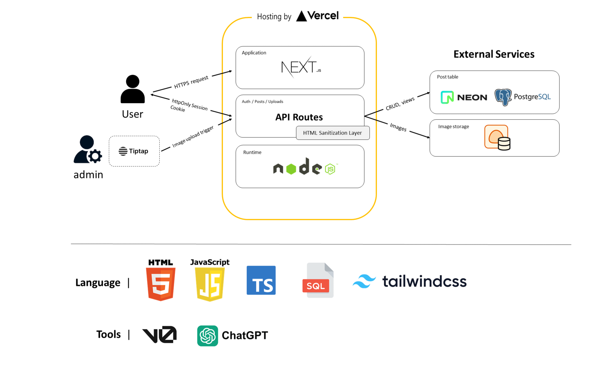

# New Interprep Website

*Automatically synced with your [v0.app](https://v0.app) deployments*

   

## Overview

Interprep 신규 웹사이트 구축 프로젝트입니다. 기존 사이트의 콘텐츠와 구조를 기반으로 하되, 기술 스택은 **Next.js 기반 풀스택 아키텍처**와 **Vercel 서버리스 인프라**로 전면 재구성했습니다. 운영과 배포 과정을 단순화하고, 장기적으로 확장 가능한 구조를 만드는 데에 초점을 두었습니다.

- 기존 사이트: https://interprep.co.kr/
- 신규 사이트: https://interprep.academy/   

## Header Menu

### 학원 소개
- 교육 이념
- 학원 소개
- 강사진
- 찾아오시는 길

### 강의
- SAT
- PreSAT
- TOEFL
- Art + English Immersion
- IPass

### 유학 · 입시 가이드
- 정보게시판
- 연도별 입시 결과

### 상담 및 문의
- 상담 문의
- FAQ
- 크레딧 제도
- 환불 규정   

## Tech Stack

### Frontend
- Next.js
- TypeScript
- HTML5 / CSS3
- Tailwind CSS
- TipTap Editor

### Backend
- Next.js API Routes
- Server-side Session (httpOnly Cookie 기반)

### Database / Storage
- Neon
- PostgreSQL
- Vercel Blob Storage

### Infrastructure / DevOps
- Vercel
- Environment Variables
- Node.js   

## System Architecture

- Next.js를 사용하여 프론트엔드와 백엔드를 통합한 풀스택 구조를 구축했습니다.
- Vercel 서버리스 환경을 사용하여 별도의 서버 운영 없이 자동 배포 및 HTTPS 기반 서비스를 제공합니다.
- Next.js API Routes를 사용하여 게시글 CRUD, 인증, 조회수 처리 로직을 서버 단에서 구현했습니다.
- httpOnly Cookie 기반 세션 인증을 사용하여 관리자 기능을 안전하게 보호합니다.
- Neon PostgreSQL을 사용하여 게시글, 조회수 데이터를 안정적으로 저장하고 관리합니다.
- Vercel Blob Storage를 사용하여 게시글 이미지를 외부 스토리지에 저장하고 퍼블릭 URL을 제공합니다.
- HTML Sanitization Layer를 적용하여 사용자 입력 기반 보안 위협(XSS)을 방지합니다.

 
